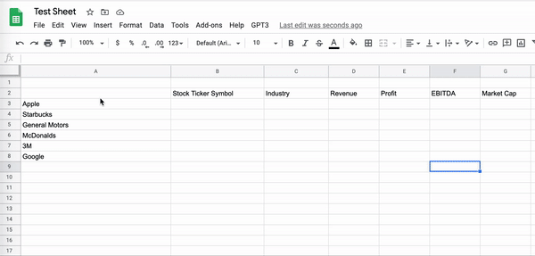
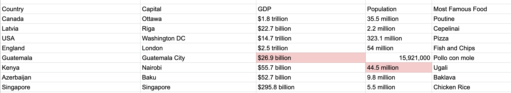
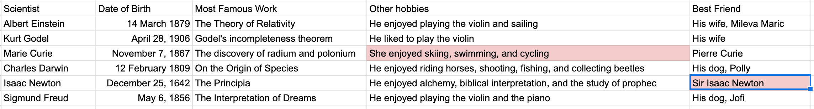
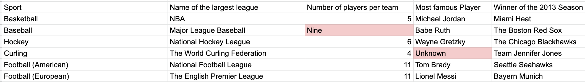

# Spreadsheet Magic
This simple add-on to Google Sheets uses OpenAI's GPT3 model to fill out data tables automatically, inferring from the row and column headings what data the user wants. The resulting data frequently accurate but is not guaranteed to be so.

## Simple Installation

1. Open a google sheet.
2. Click Menu -> Tools -> Script Editor
3. Copy the contents of Code.js into the script editor, and put your OpenAI API key in the relevant location.
4. Click save. You may have to consent to a few authentication dialogs.
5. Refresh your google sheet. You should see a new menu bar item "GPT3".

## Usage

Simply fill out row and column titles for an empty table, highlight the table and headings, and select "GPT3 Fill" from the menu bar. Wait a few moments and you should see entries begin to appear in the table.

The way this script infers what data you want in your table by looking at the row and column headings, so care should be taken in selecting them. We assume that properties are described by column headings and entities are described by row headings. The query that is put to GPT3 is roughly of the form: "What is the [column_heading] of [row_heading]?"

## Usage examples

Here are some examples of tables that have been fully filled out by this tool. Answers that are clearly or questionably incorrect are highlighted in red.

Numeric and subjective facts about different nations.

Information about famous scientists.

Facts about different sports.

## Locally editable installation

It is possible to develop, push, and deploy this script locally. Please see the  documentation for instructions on how to set this up. When developing locally it is best-practice to keep your API key in the file `.apikey.env` instead of in `Code.js`. The shell script `push.sh` can be used to deploy your script with the key included while keeping the key out of your github/source control.

## Further development

There are a lot of things which could be improved in this tool. Here are some ideas or directions I may work in in the future.

- Performance: the script currently makes a single API call for every cell. It is very likely this could be reduced by using a more clever prompt to GPT3.
- Parsing: the parsing logic for answers which come out of the AI is very basic. Improvements here would greatly improve the accuracy of the tool.
- Prompt improvements: It is likely that small modifications to the prompt could increase the accuracy of the table-filling substantially.

